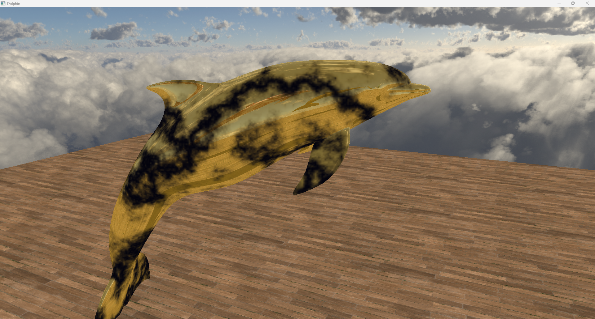
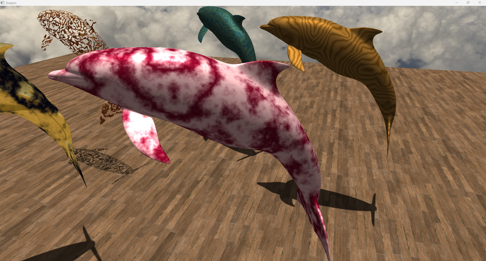
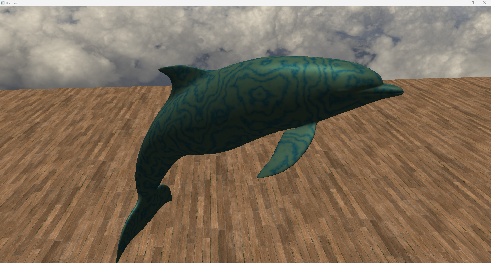
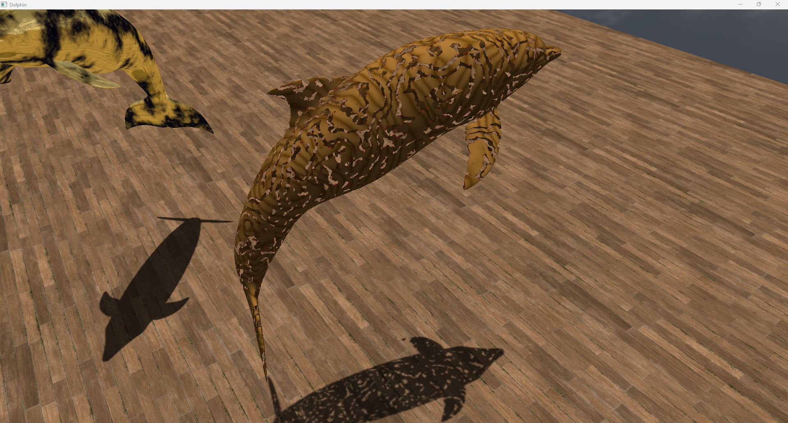

# 3D Procedural Textures

This project is an exploration of procedurally generated 3D textures using OpenGL. It showcases different techniques for creating realistic and interesting textures for 3D models without relying on pre-made image files. The scene features multiple models, each demonstrating a different procedural texture or graphical effect.

---
## Features

* **Procedural Textures**:
    * **Marble**: A versatile marble texture generator with customizable parameters for veins, colors, and patterns. Different variations like blue-veined, red, and gold marble are showcased.
    * **Wood**: A procedural wood texture that simulates the appearance of wood grain.
* **Advanced Graphics Effects**:
    * **Directional Shadows**: Dynamic shadows are cast by the models in the scene, adding depth and realism.
    * **Skybox**: A skybox provides a background and contributes to the overall ambiance of the scene.
    * **Cubemap Reflections**: A gold-textured model reflects its environment in real-time using a cubemap, creating a realistic metallic appearance.
    * **Dissolve Effect**: A dissolve shader creates a visually appealing disintegration effect on one of the models.

---
## Screenshots

Here are some screenshots from the project:

*A showcase of different procedural textures applied to the dolphin models.*

*Another view of the scene, highlighting the shadows and textures.*

*A closer look at the models and their textures.*

*A view from a different angle, showing more of the environment.*